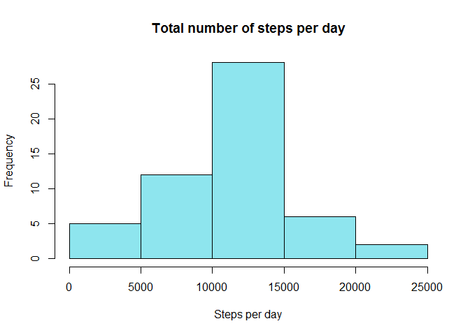

# Reproducible Research: Peer Assessment 1


## Loading and preprocessing the data

Let's just read file, convert data into date format and see the result.


```r
library(lattice)
DateType  <- "%Y-%m-%d"
FitbitData <- read.csv(unz("activity.zip", "activity.csv"), header = T)
FitbitData$date <- as.Date(FitbitData$date, DateType)
summary(FitbitData)
```

```
##      steps             date               interval     
##  Min.   :  0.00   Min.   :2012-10-01   Min.   :   0.0  
##  1st Qu.:  0.00   1st Qu.:2012-10-16   1st Qu.: 588.8  
##  Median :  0.00   Median :2012-10-31   Median :1177.5  
##  Mean   : 37.38   Mean   :2012-10-31   Mean   :1177.5  
##  3rd Qu.: 12.00   3rd Qu.:2012-11-15   3rd Qu.:1766.2  
##  Max.   :806.00   Max.   :2012-11-30   Max.   :2355.0  
##  NA's   :2304
```


## What is mean total number of steps taken per day?

For this part I've calculated total numbers steps for each day.

```r
a <- aggregate(FitbitData$steps, by=list(Category=FitbitData$date), FUN=sum)
```
So, mean and median values are:

```r
print(paste0("Mean: ", as.character(mean(a$x, na.rm = T))))
```

```
## [1] "Mean: 10766.1886792453"
```

```r
print(paste0("Median: ", as.character(median(a$x, na.rm = T))))
```

```
## [1] "Median: 10765"
```
And there is histogram:


```r
hist(a$x, main = "Total number of steps per day", xlab = "Steps per day", col = "cadetblue2")
```

 


## What is the average daily activity pattern?

Add the plot with averaged steps per interval:


```r
b <- aggregate(FitbitData$steps, by=list(Category=FitbitData$interval), FUN=mean, na.rm=TRUE)
plot(b, type="l", col="cadetblue4", lwd=2.5, 
     main="Average activity pattern", 
     xlab="Interval", ylab="Average number of steps")
```

 

## Imputing missing values
Let's fill NA values.

The total number of missing values in the dataset

```r
sum(is.na(FitbitData$steps))
```

```
## [1] 2304
```

```NA``` are located only in ```steps``` column. I replaced NA by averages steps per 5-min interval. And save this new dataset as ```FitbitData_woNA```.


```r
FitbitData_woNA <- FitbitData
NA_intervals <- FitbitData_woNA$interval[is.na(FitbitData_woNA$steps)]
NA_steps <- numeric()
for (i in NA_intervals){
    NA_steps <- c(NA_steps, b$x[b$Category == i])
}
FitbitData_woNA$steps[is.na(FitbitData_woNA$steps)] <- NA_steps
head(FitbitData_woNA)
```

```
##       steps       date interval
## 1 1.7169811 2012-10-01        0
## 2 0.3396226 2012-10-01        5
## 3 0.1320755 2012-10-01       10
## 4 0.1509434 2012-10-01       15
## 5 0.0754717 2012-10-01       20
## 6 2.0943396 2012-10-01       25
```

```r
head(FitbitData)
```

```
##   steps       date interval
## 1    NA 2012-10-01        0
## 2    NA 2012-10-01        5
## 3    NA 2012-10-01       10
## 4    NA 2012-10-01       15
## 5    NA 2012-10-01       20
## 6    NA 2012-10-01       25
```
This is a histogram of the total number of steps per each day for this new dataset:


```r
c <- aggregate(FitbitData_woNA$steps, by=list(Category=FitbitData_woNA$date), FUN=sum)
hist(c$x, main = "Total number of steps per day", xlab = "Steps per day", col = "cadetblue2")
```

 

Mean and median values for this new dataset are:

```r
print(paste0("Mean for old dataset: ", as.character(mean(a$x, na.rm = T))))
```

```
## [1] "Mean for old dataset: 10766.1886792453"
```

```r
print(paste0("Mean for new dataset: ", as.character(mean(c$x))))
```

```
## [1] "Mean for new dataset: 10766.1886792453"
```

```r
print(paste0("Median for old dataset: ", as.character(median(a$x, na.rm = T))))
```

```
## [1] "Median for old dataset: 10765"
```

```r
print(paste0("Median  for new dataset: ", as.character(median(c$x))))
```

```
## [1] "Median  for new dataset: 10766.1886792453"
```

Mean and median value didn't change. It can be due to ```na``` values present only for one day (1st Oct). And steps for *every* intervals of this day is ```na```. And when I replaced these values by mean values nothing changes (at least for calculation of mean and median).

## Are there differences in activity patterns between weekdays and weekends?

Set up locale

```r
Sys.setlocale("LC_TIME", "English")
```

```
## [1] "English_United States.1252"
```

And divide dataset into two:


```r
wd <- c("Monday", "Tuesday", "Wednesday", "Thursday", "Friday")
FitbitData_woNA$day <- weekdays(FitbitData_woNA$date)
FitbitData_weekday<-FitbitData_woNA[FitbitData_woNA$day %in% wd, ]
FitbitData_weekend<-FitbitData_woNA[!(FitbitData_woNA$day %in% wd), ]
b_we <- aggregate(FitbitData_weekend$steps, by=list(Category=FitbitData_weekend$interval), FUN=mean)
b_wd <- aggregate(FitbitData_weekday$steps, by=list(Category=FitbitData_weekday$interval), FUN=mean)

total_Data <- data.frame( day = as.factor(c(rep("weekdays", length(b_wd$x)), rep("weekend", length(b_we$x)))),
                          int = c(b_wd$Category, b_we$Category),
                          x = c(b_wd$x, b_we$x))
```

And plot the results:


```r
xyplot(x~int | day, data = total_Data, type="l",
   main="Average activity pattern on weekend",
   ylab="Miles per Gallon", xlab="Car Weight",
   layout=c(1,2))
```

 


We can see difference in the daily activity patterns for weekdays and the weekend. 
In weekdays there are two peaks of activity (morning and evening). At the weekend
activity distributed more smoothly.
